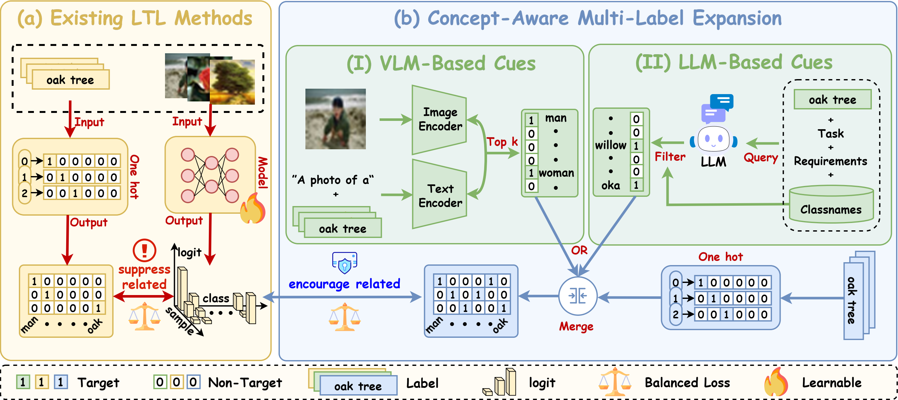

# **[CVPR 2026]** CUE: Concept-Aware Multi-Label Expansion for Long-Tailed Learning

[]()
[]()
[]()


---

# 🧠 Introduction

Long-tailed recognition suffers from **severe class imbalance** and **concept confusion** between visually similar categories. We propose **CUE (Concept-Aware Multi-Label Expansion)**, a framework that integrates Vision-Language Models (VLMs) and Large Language Models (LLMs) to generate concept-aware multi-label supervision. Instead of relying only on a single ground-truth label, CUE expands supervision using:**LLM class-level cues**, **VLM instance-level cues**. This allows the model to learn richer semantic structures and significantly improves performance on tail classes.

---

# 📊 Method Overview



CUE expands single-label supervision into **multi-label semantic cues** using two complementary sources: **1. VLM-Based Instance-Level Cues**,Language Models (e.g., CLIP) provide visual similarity predictions. **2. LLM-Based Class-Level Cues**, Large Language Models generate semantic relationships between categories. These cues are fused into a **BLA loss**, which improves recognition of tail categories.

---

# 📦 Requirements

* Python ≥ 3.8
* PyTorch 2.0
* Torchvision 0.15
* Tensorboard

Install environment:

```bash
conda create -n cue python=3.8 -y
conda activate cue

conda install pytorch==2.0.0 torchvision==0.15.0 pytorch-cuda=11.7 -c pytorch -c nvidia
conda install tensorboard

pip install -r requirements.txt
```

If dependency issues occur:

```
numpy==1.24.3
scipy==1.10.1
scikit-learn==1.2.1
yacs==0.1.8
tqdm==4.64.1
ftfy==6.1.1
regex==2022.7.9
timm==0.6.12
```

---

# 🚀 Quick Start

## CIFAR-100-LT

```bash
python main.py -d cifar100_ir100 -m clip_vit_b16 adaptformer True 
```

This will automatically download the dataset and train **LIFT + CUE**.

---

# 🧩 Integrate CUE into your own method

If you would like to **quickly integrate CUE into your own method**, you only need to add the following module and loss function into your training pipeline.

## 📁 File: `cue_utils.py`

```python
import torch
import json

def vlm_multi_fn(zs_model, imgs, labels, topk=5):
    ...
def get_multi_fn(classes, json_path, device):
    ...
def get_multi_bla_loss(cls_num_list, tau=1.0):
    ...
```

## 🧠 Integrated Criterion

```python
def criterion_cue(self, cfg, output, image, label):
    llm_multi_label = self.llm_fn(label)
    llm_loss = self.bla_loss(output, llm_multi_label)
    vlm_multi_label = self.vlm_fn(self.zs_model, image, label)
    vlm_loss = self.bla_loss(output, vlm_multi_label)
    return cfg.llm_w * llm_loss + cfg.vlm_w * vlm_loss
```

Then, in your training loop:

```python
output = self.model(image)
loss = self.criterion(output, label)
loss = loss + self.criterion_cue(cfg, output, image, label)
```

---

# 🧾 LLM Relation File

CUE requires an **LLM-generated JSON file** describing semantic relationships.

Example:

```json
{
  "tiger": ["lion", "leopard", "jaguar"],
  "eagle": ["hawk", "falcon"]
}
```
We have provided the JSON file in the "llm_json" directory. Additionally, we have also provided `gen.ipynb` the code and the prompt for generation.


---

# 🧪 Experiments

## Places-LT
```bash
python main.py -d places_lt -m clip_vit_b16 adaptformer True 
```

## ImageNet-LT

```bash
python main.py -d imagenet_lt -m clip_vit_b16 adaptformer True 
```

## iNaturalist 2018

```bash
python main.py -d inat2018 -m clip_vit_b16 adaptformer True num_epochs 20
```


# ⭐ Acknowledgements

We thank the authors for making their code publicly available.
* [LIFT](https://github.com/shijxcs/LIFT)
* [CLIP](https://github.com/openai/CLIP)


* If you find this project useful, please consider giving a **star ⭐** to support the research.
* If you have any questions, suggestions, or find issues in the code, please feel free to contact us. I will do my best to help you.  📧 **Email:** zhangruichi@stu.xmu.edu.cn

# 📜 Citation
If you find this repository useful, please consider citing our work.

```bibtex
@inproceedings{zhang2026cue,
  title={CUE: Concept-Aware Multi-Label Expansion to Mitigate Concept Confusion in Long-Tailed Learning},
  author={Zhang, Ruichi and Shang, Chikai and Yang, Jiacheng and Li, Mengke and Zhou, Yang and Gao, Junlong and Lu, Yang},
  booktitle={Proceedings of the IEEE/CVF Conference on Computer Vision and Pattern Recognition (CVPR)},
  year={2026}
}
```